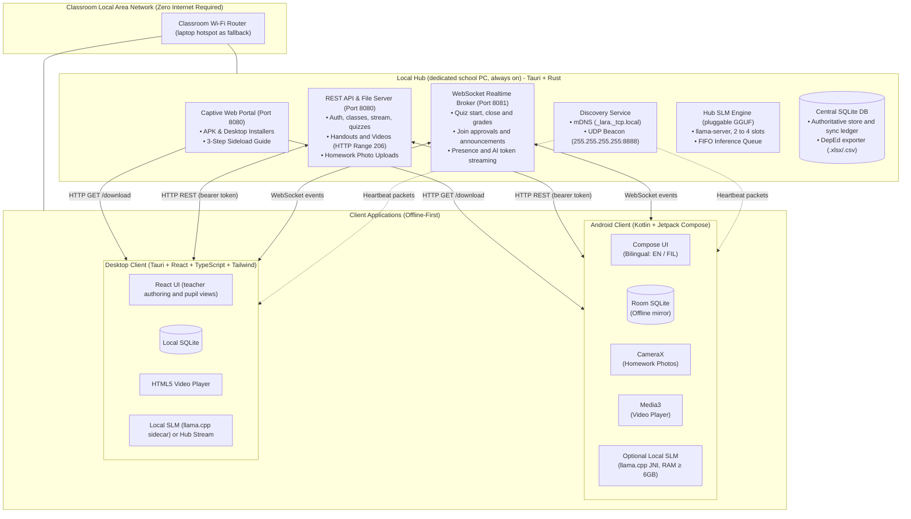
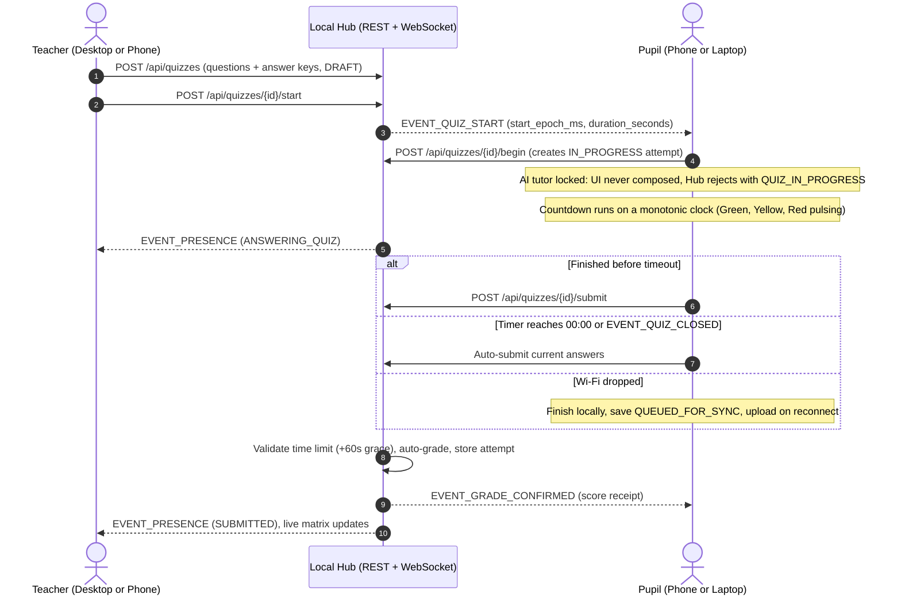
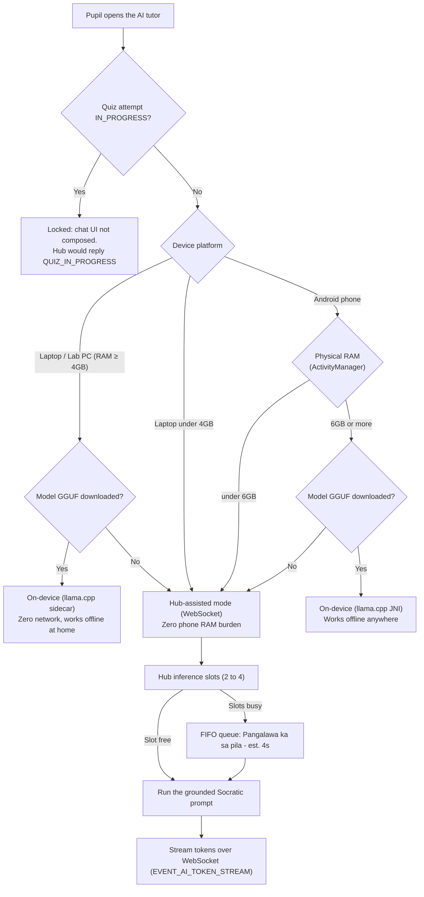

# L.A.R.A.

> **Offline LAN-Based Classroom Management System with a Socratic AI Tutor and Paperless Assessment Engine**
> *For Philippine public elementary schools (DepEd Grades 1 to 6), rural campuses and zero-internet classrooms.*

---

## What It Is

**L.A.R.A.** is an offline alternative to Google Classroom that runs entirely on the classroom's own Wi-Fi, with no internet at all. It combines:

1. **A classroom:** class cards, a stream of announcements with comments, classwork (handouts, videos, assignments), and homework submitted by photographing a notebook page.
2. **Paperless quizzes:** timed, started on every device at the same moment, auto-graded on the Hub, exported to a DepEd class record on a USB drive.
3. **A Socratic AI tutor (L.A.R.A. AI):** guides pupils with one clue and one question at a time, grounded only in the teacher's lesson text, in English or Filipino, and never gives the final answer. It is locked while a quiz is active.

It is built for the Philippine reality: over half of pupils' phones are 3 to 4 GB entry-level devices (Infinix, TECNO, itel, realme), and schools often have no usable internet. First deployment: the capstone defense plus one pilot class of about 40 pupils.

## The Three Programs

| Program | Folder | Runs on | Role |
| :--- | :--- | :--- | :--- |
| **Hub** | [`server/`](./server/) | A dedicated always-on school PC wired to the router | Master database, files and videos, quiz broker, AI queue, DepEd export, backup. Its window is an admin console. |
| **Mobile app** | [`mobile/`](./mobile/) | Android phones | Pupils (study, quizzes, homework photos, AI) and teachers (approve, post, start and monitor quizzes) |
| **Desktop app** | [`desktop/`](./desktop/) | Student laptops, lab PCs, teacher PCs | Pupils (same as mobile) and the full teacher authoring surface |

**How a class runs:** an admin creates teacher accounts. A teacher creates a class and gets a 6-character code. Pupils register (LRN + 4-digit PIN), enter the code, and the teacher approves them. Everything syncs into each device's local database so pupils can study at home with no Wi-Fi. When the pupil is back on the classroom network, queued work (finished quizzes, homework photos) uploads automatically.

---

## Where Do I Start?

| You are | Start with |
| :--- | :--- |
| **Server developer** | [`server/README.md`](./server/README.md) (Start Here checklist) and [`server/AGENTS.md`](./server/AGENTS.md) |
| **Desktop developer** | [`desktop/README.md`](./desktop/README.md) and [`desktop/AGENTS.md`](./desktop/AGENTS.md) |
| **Mobile developer** | [`mobile/README.md`](./mobile/README.md) and [`mobile/AGENTS.md`](./mobile/AGENTS.md) |
| **AI agent** | [`AGENTS.md`](./AGENTS.md) (also `CLAUDE.md`), then the nested guide for your folder |
| **Lead Developer / reviewer** | [`rules/team-workflow-and-prs.md`](./rules/team-workflow-and-prs.md) and the `lara-co-lead` skill |
| **Anyone** | The documentation map in [`docs/README.md`](./docs/README.md) |

### Quick start (any team)
```bash
python3 scripts/mock_hub.py                 # Hub simulator: REST :8080, WebSocket :8081, UDP :8888
python3 -m unittest discover tests          # contract, schema and mock hub tests
python3 scripts/verify_invariants.py        # offline and localization guardrail
```
Mock hub seed accounts (PIN `1234`): `T-0001` teacher (class code `K7M4QX`), `123456789012` pupil (enrolled), `123456789013` pupil (join with the code), `ADMIN-0001`.

### Find Your Issues

Every issue carries a **team label** (`scope:server`, `scope:desktop`, `scope:mobile`, `scope:qa`), a **sprint label** (`sprint:0` to `sprint:6`) and, for developers, a **slot label** (`slot:dev-a`, `slot:dev-b`). Click a link to see exactly your list. Click the same filter in the GitHub label box to combine more.

| Team | All open | Dev A | Dev B | S0 | S1 | S2 | S3 | S4 | S5 | S6 |
| :--- | :--- | :--- | :--- | :--- | :--- | :--- | :--- | :--- | :--- | :--- |
| **Server** | [all](https://github.com/BootlegYouki/L.A.R.A/issues?q=is%3Aissue%20is%3Aopen%20label%3A%22scope%3Aserver%22) | [A](https://github.com/BootlegYouki/L.A.R.A/issues?q=is%3Aissue%20is%3Aopen%20label%3A%22scope%3Aserver%22%20label%3A%22slot%3Adev-a%22) | [B](https://github.com/BootlegYouki/L.A.R.A/issues?q=is%3Aissue%20is%3Aopen%20label%3A%22scope%3Aserver%22%20label%3A%22slot%3Adev-b%22) | [S0](https://github.com/BootlegYouki/L.A.R.A/issues?q=is%3Aissue%20is%3Aopen%20label%3A%22scope%3Aserver%22%20label%3A%22sprint%3A0%22) | [S1](https://github.com/BootlegYouki/L.A.R.A/issues?q=is%3Aissue%20is%3Aopen%20label%3A%22scope%3Aserver%22%20label%3A%22sprint%3A1%22) | [S2](https://github.com/BootlegYouki/L.A.R.A/issues?q=is%3Aissue%20is%3Aopen%20label%3A%22scope%3Aserver%22%20label%3A%22sprint%3A2%22) | [S3](https://github.com/BootlegYouki/L.A.R.A/issues?q=is%3Aissue%20is%3Aopen%20label%3A%22scope%3Aserver%22%20label%3A%22sprint%3A3%22) | [S4](https://github.com/BootlegYouki/L.A.R.A/issues?q=is%3Aissue%20is%3Aopen%20label%3A%22scope%3Aserver%22%20label%3A%22sprint%3A4%22) | [S5](https://github.com/BootlegYouki/L.A.R.A/issues?q=is%3Aissue%20is%3Aopen%20label%3A%22scope%3Aserver%22%20label%3A%22sprint%3A5%22) | [S6](https://github.com/BootlegYouki/L.A.R.A/issues?q=is%3Aissue%20is%3Aopen%20label%3A%22scope%3Aserver%22%20label%3A%22sprint%3A6%22) |
| **Desktop** | [all](https://github.com/BootlegYouki/L.A.R.A/issues?q=is%3Aissue%20is%3Aopen%20label%3A%22scope%3Adesktop%22) | [A](https://github.com/BootlegYouki/L.A.R.A/issues?q=is%3Aissue%20is%3Aopen%20label%3A%22scope%3Adesktop%22%20label%3A%22slot%3Adev-a%22) | [B](https://github.com/BootlegYouki/L.A.R.A/issues?q=is%3Aissue%20is%3Aopen%20label%3A%22scope%3Adesktop%22%20label%3A%22slot%3Adev-b%22) | [S0](https://github.com/BootlegYouki/L.A.R.A/issues?q=is%3Aissue%20is%3Aopen%20label%3A%22scope%3Adesktop%22%20label%3A%22sprint%3A0%22) | [S1](https://github.com/BootlegYouki/L.A.R.A/issues?q=is%3Aissue%20is%3Aopen%20label%3A%22scope%3Adesktop%22%20label%3A%22sprint%3A1%22) | [S2](https://github.com/BootlegYouki/L.A.R.A/issues?q=is%3Aissue%20is%3Aopen%20label%3A%22scope%3Adesktop%22%20label%3A%22sprint%3A2%22) | [S3](https://github.com/BootlegYouki/L.A.R.A/issues?q=is%3Aissue%20is%3Aopen%20label%3A%22scope%3Adesktop%22%20label%3A%22sprint%3A3%22) | [S4](https://github.com/BootlegYouki/L.A.R.A/issues?q=is%3Aissue%20is%3Aopen%20label%3A%22scope%3Adesktop%22%20label%3A%22sprint%3A4%22) | [S5](https://github.com/BootlegYouki/L.A.R.A/issues?q=is%3Aissue%20is%3Aopen%20label%3A%22scope%3Adesktop%22%20label%3A%22sprint%3A5%22) | [S6](https://github.com/BootlegYouki/L.A.R.A/issues?q=is%3Aissue%20is%3Aopen%20label%3A%22scope%3Adesktop%22%20label%3A%22sprint%3A6%22) |
| **Mobile** | [all](https://github.com/BootlegYouki/L.A.R.A/issues?q=is%3Aissue%20is%3Aopen%20label%3A%22scope%3Amobile%22) | [A](https://github.com/BootlegYouki/L.A.R.A/issues?q=is%3Aissue%20is%3Aopen%20label%3A%22scope%3Amobile%22%20label%3A%22slot%3Adev-a%22) | [B](https://github.com/BootlegYouki/L.A.R.A/issues?q=is%3Aissue%20is%3Aopen%20label%3A%22scope%3Amobile%22%20label%3A%22slot%3Adev-b%22) | [S0](https://github.com/BootlegYouki/L.A.R.A/issues?q=is%3Aissue%20is%3Aopen%20label%3A%22scope%3Amobile%22%20label%3A%22sprint%3A0%22) | [S1](https://github.com/BootlegYouki/L.A.R.A/issues?q=is%3Aissue%20is%3Aopen%20label%3A%22scope%3Amobile%22%20label%3A%22sprint%3A1%22) | [S2](https://github.com/BootlegYouki/L.A.R.A/issues?q=is%3Aissue%20is%3Aopen%20label%3A%22scope%3Amobile%22%20label%3A%22sprint%3A2%22) | [S3](https://github.com/BootlegYouki/L.A.R.A/issues?q=is%3Aissue%20is%3Aopen%20label%3A%22scope%3Amobile%22%20label%3A%22sprint%3A3%22) | [S4](https://github.com/BootlegYouki/L.A.R.A/issues?q=is%3Aissue%20is%3Aopen%20label%3A%22scope%3Amobile%22%20label%3A%22sprint%3A4%22) | [S5](https://github.com/BootlegYouki/L.A.R.A/issues?q=is%3Aissue%20is%3Aopen%20label%3A%22scope%3Amobile%22%20label%3A%22sprint%3A5%22) | [S6](https://github.com/BootlegYouki/L.A.R.A/issues?q=is%3Aissue%20is%3Aopen%20label%3A%22scope%3Amobile%22%20label%3A%22sprint%3A6%22) |
| **QA** | [all](https://github.com/BootlegYouki/L.A.R.A/issues?q=is%3Aissue%20is%3Aopen%20label%3A%22scope%3Aqa%22) | - | - | [S0](https://github.com/BootlegYouki/L.A.R.A/issues?q=is%3Aissue%20is%3Aopen%20label%3A%22scope%3Aqa%22%20label%3A%22sprint%3A0%22) | [S1](https://github.com/BootlegYouki/L.A.R.A/issues?q=is%3Aissue%20is%3Aopen%20label%3A%22scope%3Aqa%22%20label%3A%22sprint%3A1%22) | [S2](https://github.com/BootlegYouki/L.A.R.A/issues?q=is%3Aissue%20is%3Aopen%20label%3A%22scope%3Aqa%22%20label%3A%22sprint%3A2%22) | [S3](https://github.com/BootlegYouki/L.A.R.A/issues?q=is%3Aissue%20is%3Aopen%20label%3A%22scope%3Aqa%22%20label%3A%22sprint%3A3%22) | [S4](https://github.com/BootlegYouki/L.A.R.A/issues?q=is%3Aissue%20is%3Aopen%20label%3A%22scope%3Aqa%22%20label%3A%22sprint%3A4%22) | [S5](https://github.com/BootlegYouki/L.A.R.A/issues?q=is%3Aissue%20is%3Aopen%20label%3A%22scope%3Aqa%22%20label%3A%22sprint%3A5%22) | [S6](https://github.com/BootlegYouki/L.A.R.A/issues?q=is%3Aissue%20is%3Aopen%20label%3A%22scope%3Aqa%22%20label%3A%22sprint%3A6%22) |
| **Whole sprint** | [all](https://github.com/BootlegYouki/L.A.R.A/issues?q=is%3Aissue%20is%3Aopen) | - | - | [S0](https://github.com/BootlegYouki/L.A.R.A/issues?q=is%3Aissue%20is%3Aopen%20label%3A%22sprint%3A0%22) | [S1](https://github.com/BootlegYouki/L.A.R.A/issues?q=is%3Aissue%20is%3Aopen%20label%3A%22sprint%3A1%22) | [S2](https://github.com/BootlegYouki/L.A.R.A/issues?q=is%3Aissue%20is%3Aopen%20label%3A%22sprint%3A2%22) | [S3](https://github.com/BootlegYouki/L.A.R.A/issues?q=is%3Aissue%20is%3Aopen%20label%3A%22sprint%3A3%22) | [S4](https://github.com/BootlegYouki/L.A.R.A/issues?q=is%3Aissue%20is%3Aopen%20label%3A%22sprint%3A4%22) | [S5](https://github.com/BootlegYouki/L.A.R.A/issues?q=is%3Aissue%20is%3Aopen%20label%3A%22sprint%3A5%22) | [S6](https://github.com/BootlegYouki/L.A.R.A/issues?q=is%3Aissue%20is%3Aopen%20label%3A%22sprint%3A6%22) |

* **Sprint board (kanban + table):** [L.A.R.A Sprint Board](https://github.com/users/BootlegYouki/projects/2). Fields: Team, Sprint, Slot, Status. Group by Sprint or filter `team:Mobile slot:"Dev A"` in the board filter bar.
* **My assigned issues:** [assigned to me](https://github.com/BootlegYouki/L.A.R.A/issues?q=is%3Aissue%20is%3Aopen%20assignee%3A%40me)
* **Everything done so far:** [closed issues](https://github.com/BootlegYouki/L.A.R.A/issues?q=is%3Aissue%20is%3Aclosed)
* **Sprint themes, goals and per-team deliverables:** [milestones](https://github.com/BootlegYouki/L.A.R.A/milestones)
* **Contract change requests:** [`contract-change`](https://github.com/BootlegYouki/L.A.R.A/issues?q=is%3Aissue%20is%3Aopen%20label%3A%22contract-change%22)
* **Title format:** `[TEAM sprint.step]`, for example `[MOBILE 2.3]` is Mobile, Sprint 2, step 3. Open issues sort naturally by that code.

### How we work (short version)
* **One issue = one team = one PR.** Issues live in the sprint [milestones](https://github.com/BootlegYouki/L.A.R.A/milestones) and name a developer slot (Dev A or Dev B).
* **Contract first.** `contracts/` is the only shared surface. Clients build against the mock hub until the real endpoint merges.
* **Branch from `staging`,** open a PR to `staging`, the Lead reviews. `main` is updated from `staging` at sprint completion. Full rules: [`CONTRIBUTING.md`](./CONTRIBUTING.md).

---

## System Architecture



---

## Paperless Quiz Sequence & Anti-Cheat Lockout



---

## Adaptive Hybrid SLM Execution

The model is **not chosen yet**. MiniCPM5-2B is only a baseline candidate; the choice comes from a scored evaluation on the real Hub machine (see [`rules/socratic-ai-guardrails.md`](./rules/socratic-ai-guardrails.md) section 5).



---

## Project Sprint Roadmap

Seven milestones; Mobile, Desktop and Server build in parallel against the shared contracts and the mock hub. Each sprint ends with an **integration day** where clients switch from the mock hub to the real Hub on `staging`.

| Sprint | Mobile (2 devs) | Desktop (2 devs) | Server (2 devs) | Integrated outcome |
| :--- | :--- | :--- | :--- | :--- |
| **[Sprint 0](https://github.com/BootlegYouki/L.A.R.A/milestone/7): Contract Freeze** | Tech Spec | Tech Spec | Tech Spec | Contracts, mock hub and design system approved |
| **[Sprint 1](https://github.com/BootlegYouki/L.A.R.A/milestone/1): Scaffolding & Discovery** | Compose theme, Room, LAN scanner | Tauri + React, SQLite, discovery, connection screen | Hub skeleton, SQLite, UDP and mDNS, captive portal, installer | Devices find the Hub on Wi-Fi with zero internet |
| **[Sprint 2](https://github.com/BootlegYouki/L.A.R.A/milestone/2): Roles & Delta-Sync** | Login, nav shell, join dialog, approval sheet, sync worker | Login, class cards, join modal, roster, sync engine | Auth, admin console, class codes and approval, WebSocket broker, sync | A pupil joins a class with teacher approval |
| **[Sprint 3](https://github.com/BootlegYouki/L.A.R.A/milestone/3): Content & Media** | Stream and PDF, Media3, CameraX, teacher post | Stream and classwork, video, homework, teacher authoring and review | Chunker, 206 streaming, upload receivers, teacher CRUD | Video streaming and photographed homework |
| **[Sprint 4](https://github.com/BootlegYouki/L.A.R.A/milestone/4): Paperless Quizzes** | Quiz flow and timer, teacher remote, offline queue | Quiz runner, builder, live monitor | Quiz CRUD, broker, auto-grader, DepEd export, backup | Synchronized quiz with instant grades |
| **[Sprint 5](https://github.com/BootlegYouki/L.A.R.A/milestone/5): Socratic AI** | RAM router, chat sheet, prompt builder, JNI | Chat drawer, AI router, sidecar | llama-server and queue, guardrails, health dashboard | Tutor guides without giving answers |
| **[Sprint 6](https://github.com/BootlegYouki/L.A.R.A/milestone/6): Usability & Defense** | UX audit, phone profiling | UX audit | 40-device stress test | SUS survey, thesis tables, rehearsed demo |

---

## Repository Map

```
L.A.R.A/
├── AGENTS.md  (CLAUDE.md)   # Entry point for every AI agent: context, decisions, invariants, working rules
├── mobile/                  # Android client (Kotlin, Jetpack Compose, Room)   - has README, AGENTS.md, docs/
├── desktop/                 # Desktop client (Tauri 2, React 19, TypeScript)   - has README, AGENTS.md, docs/
├── server/                  # Local Hub (Tauri window + Rust/Axum/SQLx)        - has README, AGENTS.md, docs/
│
├── contracts/               # THE shared surface (Lead-owned)
│   ├── openapi.yaml         #   REST API
│   ├── events/              #   WebSocket event schemas + handshake README
│   ├── schema/              #   server_master.sql and client_offline.sql
│   └── naming_rules.md      #   serialization and privacy rules
│
├── design-system/           # Tokens, Kotlin theme, Tailwind theme, bundled Nunito and Phosphor (Lead-owned)
├── rules/                   # Architecture guardrails by domain (Lead-owned)
├── scripts/                 # mock_hub.py (full Hub simulator) and verify_invariants.py
├── tests/                   # Contract, schema, mock hub and coverage tests
├── docs/                    # PRD, design system, architecture notes, templates (see docs/README.md)
└── .github/                 # CI, CODEOWNERS, PR and issue templates
```

---

## Full Documentation

* Documentation map and reading order by role: [`docs/README.md`](./docs/README.md)
* Product requirements: [`docs/PRD.md`](./docs/PRD.md)
* Visual rules: [`design-system/design-system.md`](./design-system/design-system.md)
* Workflow and PR rules: [`CONTRIBUTING.md`](./CONTRIBUTING.md) and [`rules/team-workflow-and-prs.md`](./rules/team-workflow-and-prs.md)
