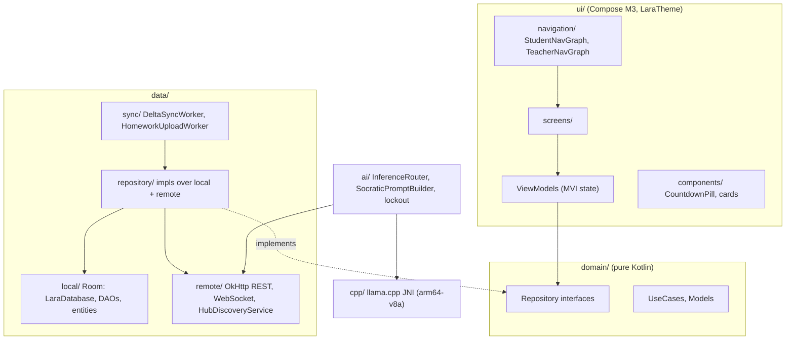

# Mobile Technical Spec

> Owner: Mobile team  |  Reviewer: Lead Developer (Tech Lead)  |  Status: Draft  |  Last updated: 2026-10-08
> This is not a PRD. Product behavior lives in `docs/PRD.md` and `contracts/`. This document says how this team will build its part. Never redefine behavior here; link to the source instead.
> AI agents read this file as context in every session. Read [`TECH_SPEC_GUIDE.md`](../../docs/templates/TECH_SPEC_GUIDE.md) before filling it in. Keep the headings unchanged, use exact names and paths in backticks, and write "must" or "must not".

## 1. Scope and Non-Goals

**In scope.** The native Android app (`org.lara.app`) for learners and teachers, built offline-first against `scripts/mock_hub.py` until integration day. Sprint-to-PRD map (behavior is defined in the cited `docs/PRD.md` FRs, not here):

| Sprint | Issues | PRD modules |
|---|---|---|
| 1 Scaffolding & LAN discovery | `[MOBILE 1.1]` #23, `[MOBILE 1.2]` #4, `[MOBILE 1.3]` #41 | PRD §3.1 discovery; §6.1 client schema |
| 2 Roles, classrooms & delta-sync | `[MOBILE 2.1]` #24, `[MOBILE 2.2]` #49, `[MOBILE 2.3]` #50, `[MOBILE 2.4]` #51, `[MOBILE 2.5]` #52, `[MOBILE 2.6]` #106 | FR-1.1, FR-1.2, FR-1.3; §6.2 sync |
| 3 Stream, media & homework | `[MOBILE 3.1]` #25, `[MOBILE 3.2]` #9, `[MOBILE 3.3]` #59, `[MOBILE 3.4]` #60 | FR-2.1, FR-2.2, FR-2.3, FR-3.1, FR-3.3, FR-3.5 |
| 4 Paperless quiz & gradebook | `[MOBILE 4.1]` #26, `[MOBILE 4.2]` #64, `[MOBILE 4.3]` #65, `[MOBILE 4.4]` #107 | FR-4.1..FR-4.6, FR-5.1 (read-only matrix) |
| 5 Socratic AI | `[MOBILE 5.1]` #15, `[MOBILE 5.2]` #27, `[MOBILE 5.3]` #69, `[MOBILE 5.4]` #70, `[MOBILE 5.5]` #102 | PRD §5 (all) |
| 6 Audit & stress test | `[MOBILE 6.1]` #18, `[MOBILE 6.2]` #28 | PRD §8, §10 |

**Non-goals (this team must not build these; cite `docs/PRD.md` §9 Out-of-Scope):**
- AI auto-grading of handwritten photos or essays — subjective grading stays manual on the teacher side.
- Any cloud sync or external service (Firebase, Google Play Services, CDNs, remote telemetry) — see `rules/networking-and-lan.md` §1.
- LoRa / Bluetooth mesh, and live video conferencing.
- The Hub, its database, REST/WS server, `llama-server` queue, gradebook `.xlsx` export generation — all owned by `server/`. Mobile only triggers/reads export via the contract.

## 2. Architecture

Clean Architecture + MVI/MVVM (AGENTS §6.1). Three layers plus two leaf modules. Dependencies point inward only.



**Entry points:** `MainActivity` hosts `LaraApp` (the Compose root), which selects `StudentNavGraph` or `TeacherNavGraph` by the authenticated role.

**Import rules (must / must not):**
- Screens and ViewModels **must** depend only on `domain/` repository interfaces. They **must not** import Room, OkHttp, or any `data/` class directly.
- `domain/` is pure Kotlin: it **must not** import Android, Room, OkHttp, or Compose.
- Only `data/repository/` may touch both `data/local/` and `data/remote/`.
- `ai/` reaches the Hub only through `data/remote/`; `cpp/` is used only by `ai/`.

## 3. Key Decisions
| Decision | Choice | Why | Rejected alternative |
|---|---|---|---|
| HTTP + serialization | `OkHttp 4.x` + `kotlinx.serialization` | One client reused for REST, the `WebSocketListener` (port 8081) and the Media3 data source; fewest moving parts; matches the `MulticastLock`/WebSocket examples in `rules/networking-and-lan.md` | `Ktor Client` — adds a second networking layer beside the OkHttp WebSocket the rules already assume |
| Local persistence | `Android Room` (SQLite) | Compile-time SQL validation, migrations, Coroutine/Flow support; mandated by `rules/database-and-sync.md` §5 | `Prisma`/other ORM — strictly forbidden (binary bloat) |
| UI pattern | MVI/MVVM + `StateFlow` + `ViewModel` | Single immutable screen state is testable and survives config change; mandated by AGENTS §6.1 | Plain `LiveData`/callback state — harder to test, drifts across sessions |
| Background sync & upload | `WorkManager` | Survives Transsion/realme battery killers and process death; retriable | Raw coroutine scope — killed by vendor battery optimization (`rules/networking-and-lan.md` §4.3) |
| Quiz countdown clock | `SystemClock.elapsedRealtime()` + offset from `EVENT_HELLO_ACK` | Monotonic; survives wall-clock changes and Wi-Fi drops (`rules/quiz-and-anti-cheat.md` §2, §3) | `System.currentTimeMillis()` — Hub/phone wall clocks are unreliable offline |
| Token storage | Encrypted storage (`EncryptedSharedPreferences`) | Token is a bearer credential; `rules/database-and-sync.md` §2 forbids plaintext secrets on the client | Plaintext prefs / Room column — leaks on a rooted budget phone |
| UI and data seam | Repository interfaces in `domain/` | Screens depend on interfaces, so they can be built and tested against fakes | Screens calling concrete `data/` classes directly |

## 4. File Map
Tree this team creates (from `mobile/AGENTS.md` §Layout and `mobile/README.md` §4). One line per folder: what it holds / what must not.

```text
app/src/main/
├── cpp/                         llama.cpp JNI (arm64-v8a) only; no business logic
├── java/org/lara/app/
│   ├── data/
│   │   ├── local/               Room LaraDatabase, DAOs, entities; must not hold network types
│   │   ├── remote/              OkHttp REST, WebSocket, HubDiscoveryService, MulticastLock; must not touch Room
│   │   ├── sync/                DeltaSyncWorker, HomeworkUploadWorker; must not hold UI
│   │   └── repository/          impls over local + remote; the only place that joins both
│   ├── domain/                  Models, repository interfaces, UseCases; pure Kotlin, no Android imports
│   ├── ai/                      InferenceRouter, SocraticPromptBuilder, quiz lockout; no direct Room access
│   └── ui/
│       ├── navigation/          StudentNavGraph, TeacherNavGraph; no data imports
│       ├── theme/               LaraTheme tokens copied from design-system/mobile; no Color(0xFF...) elsewhere
│       ├── components/          52dp buttons, cards, CountdownPill; no network/db calls
│       └── screens/             Compose screens + ViewModels; depend only on domain/
└── res/
    ├── values/strings.xml       canonical English strings
    └── values-tl/strings.xml    Filipino strings (CI enforces parity)
```

Companion docs live in `mobile/docs/*.md` (`navigation.md`, `room_schema.md`, `discovery.md`, `sync_worker.md`, `camerax.md`, `video_player.md`, `quiz_runner.md`, `ai_routing.md`, `budget_device_benchmarks.md`) — this spec links to them to stay short.

## 5. Names (one name per thing)
| Name | Kind | Responsibility |
|---|---|---|
| `LaraDatabase` | Room class | Single Room DB; entities mirror `contracts/schema/client_offline.sql` |
| `SyncRepository` | domain interface + impl | Pull/push delta-sync; applies response + `next_cursor` in one `@Transaction` |
| `DeltaSyncWorker` | WorkManager Worker | Runs `SyncRepository` pull/push on connectivity |
| `HomeworkUploadWorker` | WorkManager Worker | Uploads queued homework photos idempotently by `submission_id` |
| `HubDiscoveryService` | class | NSD `_lara._tcp.local` + UDP `:8888` beacon + manual IP; owns `MulticastLock` |
| `QuizSessionManager` | class | Owns attempt state, monotonic countdown, auto-submit, offline queue |
| `SocraticPromptBuilder` | class | Builds the grounded Socratic prompt from `material_chunks` |
| `InferenceRouter` | class | Routes AI to Hub (<6 GB RAM) or local GGUF (≥6 GB); enforces lockout |
| `CountdownPill` | Composable | Green/Yellow/Red timer pill (`rules/quiz-and-anti-cheat.md` §2) |
| `org.lara.app.data.local.entities.*` | package | One Room entity per client table |

## 6. Contract Usage
Every route/event the client touches. Links: [`contracts/openapi.yaml`](../../contracts/openapi.yaml), [`contracts/events/`](../../contracts/events/). Nothing copied. Default on timeout / Hub-unreachable (offline-first, AGENTS §3.2): reads serve the Room mirror; writes persist locally as `QUEUED_FOR_SYNC`; the WebSocket reconnects with backoff 1s/2s/4s/max 10s; the app never shows a blocking error.

### REST (`contracts/openapi.yaml`)
| Route | Our module | On error | On timeout / Hub unreachable |
|---|---|---|---|
| `POST /api/auth/register` | `data/remote` AuthApi | `409` → "ID already registered", stay on form | Keep form; retry when reachable; no local account created |
| `POST /api/auth/login` | AuthApi | `401` → wrong ID/PIN message | If a valid token is cached, enter offline (home-study) mode |
| `POST /api/auth/logout` | AuthApi | — | Clear local session immediately; fire-and-forget |
| `GET /api/classrooms` | ClassroomRepository | `401` → re-auth | Serve mirrored classrooms from Room |
| `POST /api/classrooms/join` | ClassroomRepository | `404` (code `CLASS_CODE_INVALID`) → inline error | Disable Join while offline; `EVENT_JOIN_REQUEST` arrives on reconnect |
| `GET /api/classrooms/{id}/roster` (teacher) | ClassroomRepository | `403` → hide | Serve last roster from Room |
| `POST /api/classrooms/{id}/approve` / `reject` (teacher) | ClassroomRepository | `403`/`404` → toast | Queue intent; emits `EVENT_JOIN_APPROVAL` when sent |
| `POST /api/sync/pull` | `SyncRepository` | malformed → roll back, keep old cursor | No-op; retry via `DeltaSyncWorker` |
| `POST /api/sync/push` | `SyncRepository` | per-item `REJECTED`+reason (e.g. `TIME_LIMIT_EXCEEDED`) → row stays visible with explanation | Rows stay `QUEUED_FOR_SYNC`; worker retries |
| `POST /api/announcements` (teacher) | StreamRepository | `403` → toast | Teacher post requires Hub; disable with reason |
| `PATCH`/`DELETE /api/announcements/{id}` (teacher) | StreamRepository | `403`/`404` | Requires Hub; disable |
| `GET`/`POST /api/announcements/{id}/comments` | StreamRepository | `403 COMMENTS_DISABLED` → hide composer | Read from Room; new comment `QUEUED_FOR_SYNC` via push |
| `GET /api/materials/{id}/download` | MaterialRepository | `404` → "not available" | Serve `materials.local_file_path` if cached |
| `GET /api/materials/{id}/chunks` | MaterialRepository | `404` | Serve mirrored chunks for Socratic grounding |
| `GET /api/materials/{id}/stream` | `data/remote` (OkHttp + Media3), `?token=` | `416` (not in contract; treated as the stream error state)/`404` → error state | Play local file if "Saved for Home"; else disabled |
| `POST /api/assignments/{id}/submit` | `HomeworkUploadWorker` | `413 FILE_TOO_LARGE` → recompress <800 KB | Store JPEG locally `QUEUED_FOR_SYNC` with client `submission_id`; upload on reconnect |
| `GET /api/assignments/{id}/submissions` (teacher) | AssignmentRepository | `403` | Serve mirror |
| `PATCH /api/submissions/{id}` (teacher grade) | AssignmentRepository | `403`/`404` | Requires Hub; disable grading |
| `GET /api/submissions/{id}/file` | AssignmentRepository, `?token=` | `403`/`404` | Serve local copy if owner |
| `GET /api/quizzes/active` | QuizRepository | `404` → no active quiz | Serve mirror; show "connect to start" |
| `GET /api/quizzes/{id}` | QuizRepository | `404` | Redacted payload only; never request `correct_answer` |
| `POST /api/quizzes/{id}/start` / `close` (teacher) | QuizRepository | `403`/`404` | Requires Hub; disable control |
| `POST /api/quizzes/{id}/begin` | `QuizSessionManager` | `404` | Begin requires Hub (creates `IN_PROGRESS`); if dropped mid-quiz, continue locally |
| `POST /api/quizzes/{id}/submit` | `QuizSessionManager` | `422 TIME_LIMIT_EXCEEDED` → show server verdict | Save attempt `QUEUED_FOR_SYNC`; auto-flush on reconnect |
| `GET /api/quizzes/{id}/results` (teacher) | QuizRepository | `403` | Serve mirror; live updates via `EVENT_PRESENCE` |
| `POST /api/export/class-record` (teacher trigger) | ExportRepository | `403` | Requires Hub; disable; generation is server-side |

### WebSocket events (`contracts/events/`)
After a reconnect, send `last_event_id` in `EVENT_HELLO`; anything still missed is recovered by `POST /api/sync/pull`.

| Event | Our module | On error / unexpected | On timeout / Hub unreachable |
|---|---|---|---|
| `EVENT_HELLO` → `EVENT_HELLO_ACK` | `data/remote` WsClient | close `4401` → re-auth; store `hub_id`, `sync_epoch`, clock offset | Reconnect with backoff; UI stays usable offline |
| `EVENT_JOIN_REQUEST` (teacher) | ClassroomRepository | ignore unknown fields | Recovered via `POST /api/sync/pull` |
| `EVENT_JOIN_APPROVAL` (learner) | ClassroomRepository | — | Enrollment status recovered on next pull |
| `EVENT_ANNOUNCEMENT_PUSH` | StreamRepository | — | Missed push recovered on pull |
| `EVENT_QUIZ_START` | `QuizSessionManager` | compute offset from `start_epoch_ms` | Recover active quiz via `GET /api/quizzes/active` |
| `EVENT_QUIZ_CLOSED` | `QuizSessionManager` | lock input, auto-submit | Local timer still auto-submits at 00:00 |
| `EVENT_QUIZ_SUBMIT` (learner→Hub) | `QuizSessionManager` | same grading path as REST submit | Fallback to `POST .../submit` on reconnect |
| `EVENT_GRADE_CONFIRMED` | QuizRepository | — | Receipt recovered on pull (held scores release later) |
| `EVENT_PRESENCE` (teacher) | QuizRepository | — | Live matrix stale until reconnect |
| `EVENT_AI_CHAT_REQUEST` (learner→Hub) | `InferenceRouter` | `EVENT_ERROR QUIZ_IN_PROGRESS` → never sent during quiz; `AI_QUEUE_FULL` → kind retry | AI sheet says available when connected to the Hub |
| `EVENT_QUEUE_STATUS` | `InferenceRouter` | — | Shown only while connected |
| `EVENT_AI_TOKEN_STREAM` | `InferenceRouter` | partial stream → show received tokens | Stream ends on disconnect; offer retry |
| `EVENT_ERROR` | WsClient | map `code` to the handling above | — |

## 7. Data and Offline Behavior

**Local storage.** `LaraDatabase` holds one Room entity per table in [`contracts/schema/client_offline.sql`](../../contracts/schema/client_offline.sql) (linked, not copied). A schema test compares Room's exported schema against the SQL file (`room_schema.md`). The client **must not** define `users.pin_hash`, other people's `lrn_or_id`, `quiz_questions.correct_answer`/`synonyms_json`, or server file paths (`rules/database-and-sync.md` §2). Client-only columns: `sync_status`, `materials.local_file_path`, and the `sync_state` key/value table (`hub_id`, `sync_epoch`, `cursor`, `current_user_id`).

**`sync_status` lifecycle** (on `assignment_submissions`, `quiz_attempts`, `announcement_comments`):
`QUEUED_FOR_SYNC` (created offline) → push/upload → on a `SYNCED` receipt mark `SYNCED`; on a `REJECTED` receipt the row stays visible with a kind explanation and is **never** silently deleted (`rules/database-and-sync.md` §3.4).

**Cursor & transaction rule.** The cursor is `sync_revisions.seq`, a strictly increasing integer — **never** a clock time. The client **must** apply the whole pull response **and** store `next_cursor` in **one** `@Transaction`; on failure it rolls back and keeps the old cursor. If `has_more`, pull again immediately. `server_time` is used only for the quiz clock offset.

**Reset.** When the response has `reset: true` (different `hub_id`/`sync_epoch`, restored backup, or pruned tombstones), the client wipes the mirrored tables **but keeps rows still `QUEUED_FOR_SYNC`**, then applies the response starting from cursor 0.

**Per-screen Hub-unreachable behavior.** Launch never shows a blocking "No Connection" dialog (`rules/database-and-sync.md` §6). Stream/Classwork/Quiz-history read from Room; cached PDFs and "Saved for Home" videos play; homework photos capture and queue; the AI sheet works only if ≥6 GB RAM + model installed, otherwise it says it is available when connected to the Hub.

## 8. Code Patterns
Worked ~10-line samples. Agents copy these.

**Repository read-from-Room (offline-first):**
```kotlin
override fun observeAnnouncements(classroomId: String): Flow<List<Announcement>> =
    announcementDao.observeByClassroom(classroomId)          // Room is the single read source
        .map { rows -> rows.map(AnnouncementEntity::toDomain) }
        .flowOn(Dispatchers.IO)
```

**OkHttp request + Error-envelope mapping:**
```kotlin
val res = client.newCall(req).await()
if (!res.isSuccessful) {
    val env = json.decodeFromString<ErrorEnvelope>(res.body!!.string())  // {"error":{"code","message"}}
    throw HubException(env.error.code, env.error.message)                // e.g. CLASS_CODE_INVALID
}
return json.decodeFromString(res.body!!.string())
```

**`@Transaction` pull-apply + `next_cursor` (atomic):**
```kotlin
@Transaction
suspend fun applyPull(r: SyncPullResponse) {
    if (r.reset) wipeMirrorKeepingQueued()           // keep QUEUED_FOR_SYNC rows
    upsertAll(r.classrooms, r.announcements, r.materials, r.materialChunks, /* ... */)
    applyTombstones(r.deleted)
    syncStateDao.put("cursor", r.nextCursor.toString())  // same transaction as the data
    syncStateDao.put("hub_id", r.hubId); syncStateDao.put("sync_epoch", r.syncEpoch.toString())
}
```

**Offline homework write (idempotent `submission_id`):**
```kotlin
val submissionId = existing?.submissionId ?: UUID.randomUUID().toString()  // reused on every retry
val jpeg = compressToJpegUnder800Kb(bitmap)                                // rules/ui-and-accessibility §5
submissionDao.upsert(SubmissionEntity(submissionId, assignmentId, jpegPath, syncStatus = "QUEUED_FOR_SYNC"))
HomeworkUploadWorker.enqueue(workManager, submissionId)                     // survives battery killers
```

**Quiz countdown on a monotonic clock:**
```kotlin
// on EVENT_HELLO_ACK
val ackElapsed = SystemClock.elapsedRealtime()
val serverAtAck = helloAck.serverTime
fun serverNow() = serverAtAck + (SystemClock.elapsedRealtime() - ackElapsed)
// on EVENT_QUIZ_START
val endElapsed = SystemClock.elapsedRealtime() + (startEpochMs + durationMs - serverNow())
fun remaining() = endElapsed - SystemClock.elapsedRealtime()       // monotonic; survives Wi-Fi drop
// at remaining() <= 0 or EVENT_QUIZ_CLOSED: lock input and auto-submit
```

**AI-lockout composition guard (never compose chat during a quiz):**
```kotlin
val attempt by quizSessionManager.state.collectAsState()
if (attempt.status != AttemptStatus.IN_PROGRESS) {
    SocraticSheet(...)                                 // composables exist only when no active attempt
} else {
    AiLockedPlaceholder()                              // disabled explanation only (rules/quiz-and-anti-cheat §1)
}
```

## 9. Pitfalls
| Trap | Fix |
|---|---|
| Transsion/realme/itel battery killers stop background work | Use `WorkManager` for sync and uploads; test with vendor battery optimization **on** (`budget_device_benchmarks.md`) |
| Android drops UDP discovery packets to save power | Acquire `WifiManager.MulticastLock("lara_discovery_lock")` before listening on `:8888`; release when discovery stops |
| Router AP/client isolation blocks the beacon | Manual IP entry **must** always be available on the connection screen |
| Room cannot express CHECK, partial index, or AUTOINCREMENT | Mirror columns/nullability/defaults exactly; enforce the CHECK rules (one active quiz, weights=100, attempt state) in the repository layer |
| OOM on 3–4 GB phones | Never decode full-size bitmaps; page lists; stream downloads; keep heap < 250 MB |
| `!!` / unhandled nulls in production paths | Forbidden; model absence/empty states explicitly |
| Answer-key leakage | `correct_answer`/`synonyms` **must not** appear in any DTO, entity, or log; students use the redacted quiz payload |
| Loading a model under 6 GB RAM | `InferenceRouter` **must** gate local GGUF behind `ActivityManager` total RAM ≥ 6 GB; otherwise Hub-assisted only |

## 10. Build Order
The mobile team works one issue at a time, in step order, with one open PR (`rules/team-workflow-and-prs.md` §1.1). Both developers work the same issue. There are no developer slots.

| Sprint | Order | What each step creates that later steps reuse |
|---|---|---|
| 1 | #23 scaffold, #4 discovery, #41 Room | `LaraTheme` and tokens (#23); `HubConnection` and `MulticastLock` handling (#4); entities, DAOs and repository interfaces in `domain/` (#41) |
| 2 | #24 nav shell, #49 login, #50 join, #51 approval sheet, #52 sync, #106 settings | Student and Teacher graphs (#24); token storage (#49); `DeltaSyncWorker` (#52) |
| 3 | #25 stream and PDF, #9 camera, #59 video, #60 post announcement | `SubmissionRepository` and `HomeworkUploadWorker` (#9) |
| 4 | #26 quiz flow, #64 teacher controller, #65 offline queue, #107 My Work | `CountdownPill` and the quiz-state observer that keeps the AI uncomposed (#26) |
| 5 | #15 RAM router, #27 chat sheet, #69 prompt and lockout, #70 JNI, #102 model download | `InferenceRouter` (#15) |
| 6 | #18 profiling, #28 UX audit | |

A later step imports what an earlier step created; it never re-creates it.

## 11. Dependencies on Other Teams
- **Server (`server/`):** every REST route and WS event. Default: build against `scripts/mock_hub.py`, which implements the whole contract. A route is "real" only once its server issue merges; switch to the real Hub on **integration day** (`rules/team-workflow-and-prs.md` §1.1).
- **Lead-owned (`contracts/`, `design-system/`, `rules/`):** consumed read-only. A needed change is a separate `contract-change` PR by the Lead, merged before this team branches from it. This team **must not** edit those folders.
- **Design system:** `design-system/mobile/*.kt` and bundled Nunito are already present; copied in scaffold #23.

## 12. Risks and Unknowns
| Risk or spike | Owner | Decision date | Fallback |
|---|---|---|---|
| AI model unchosen; quality on weak hardware unproven (AGENTS §5.4) | Mobile team | before Sprint 5 start | Hub-assisted mode only; no on-device model shipped until the eval produces numbers |
| `llama.cpp` JNI `arm64-v8a` build + packaging (#70) | Mobile team | mid-Sprint 5 | Ship Hub-assisted path only; defer local inference |
| Heap < 250 MB / battery on 3–4 GB Transsion/realme phones (#18) | Mobile team | Sprint 6 | Reduce page sizes, cap caches, drop any local-AI attempt |
| mDNS/UDP fails under router AP isolation | Mobile team | Sprint 1 (during #4) | Manual IP entry (already required); document in `discovery.md` |
| Media3 Range streaming vs 2.0 MB/s Hub cap on cheap routers | Mobile team | Sprint 3 (during #59) | "Save for Home" download then local playback |

## 13. Commands and Verification
Run from the repo root unless noted. Mobile build: `./gradlew test lint` (in `mobile/`). Mock hub: `python3 scripts/mock_hub.py`. Guardrails: `python3 scripts/verify_invariants.py`. Contract/mock tests: `python3 -m unittest discover tests`.

Seed accounts (PIN `1234`): `T-0001` teacher (class code `K7M4QX`), `123456789012` enrolled learner, `123456789013` learner (joins with the code), `ADMIN-0001`. Every PR attaches evidence against the mock hub (and the real Hub on integration day) with **WAN unplugged** (`rules/team-workflow-and-prs.md` §3).

**Flows built against the mock hub first (in order):** (1) discovery + manual IP → `EVENT_HELLO_ACK`; (2) login as `123456789012`; (3) `POST /api/sync/pull` apply + cursor; (4) join as `123456789013` with `K7M4QX` → teacher `EVENT_JOIN_REQUEST` → approve → `EVENT_JOIN_APPROVAL`.

**Sprint 1-2 deliverables, each with its proving check:**
| Item | Proof against the mock hub |
|---|---|
| #23 scaffold + tokens + nav | `./gradlew test lint` green; app launches to the connection screen using `LaraTheme` tokens |
| #4 discovery + manual IP | Run `mock_hub.py`; app lists the beaconed Hub and connects; disable the beacon and connect by manual IP |
| #41 Room + DAOs + repos | Schema test: Room exported schema matches `client_offline.sql`; repository CRUD unit tests pass |
| #24 role nav shell | Login `T-0001` → `TeacherNavGraph`; `123456789012` → `StudentNavGraph` (bottom nav) |
| #49 login/register | Register a new ID → `200`; duplicate → `409` message; login `123456789012`/`1234` → token stored encrypted |
| #50 join dialog | `123456789013` enters `K7M4QX` → PENDING; status flips to ACTIVE on `EVENT_JOIN_APPROVAL` |
| #51 teacher approval sheet | As `T-0001`, `EVENT_JOIN_REQUEST` shows name+LRN; Accept → learner unlocked |
| #52 `DeltaSyncWorker` | Pull applies in one `@Transaction`; `reset:true` wipes mirror but keeps a `QUEUED_FOR_SYNC` row; push returns `SYNCED`/`REJECTED` receipts honored |

**Sprint 3-6 checks (sketched; detail when scheduled):** #9 photo compresses <800 KB and uploads idempotently by `submission_id`; #59 Media3 `206` Range playback + Save-for-Home; #26 countdown pill colors + auto-submit at 00:00 + AI chat not composed while `IN_PROGRESS`; #65 offline attempt auto-flushes on reconnect; #15 RAM router picks Hub vs local; #69 AI blocked with `QUIZ_IN_PROGRESS` during a quiz; #18 heap < 250 MB captured on a 3–4 GB device.

What proves what: unit tests cover Room/repository logic and prompt/lockout rules; integration against the mock hub covers every contract route/event; the real Hub on integration day proves the end-to-end Definition of Done.

## 14. Open Questions
Raised for the Tech Lead; not guessed.
1. **GGUF model choice** is deferred to the AI feasibility eval (`rules/socratic-ai-guardrails.md` §5 / AGENTS §5.4). Sprint 5 on-device inference stays behind that result; until then, Hub-assisted only. Confirm this sequencing.
2. **Teacher-on-mobile export scope:** mobile can trigger `POST /api/export/class-record`, but USB target paths are a Hub-console concern. Confirm mobile only triggers a download-style export (no `target_path`) and never writes USB.
3. **Encrypted token storage API:** `EncryptedSharedPreferences` (Jetpack Security) vs a KeyStore-backed custom store — confirm the Jetpack dependency is acceptable under the zero-cloud rule (it is local-only).

## 15. Invariants Checklist
- [x] No internet or CDN dependency (fonts and icons come from `design-system/assets/`)
- [x] Offline state defined for every screen
- [x] English and Filipino strings for all UI text
- [x] Touch targets at least 52dp (56dp primary and quiz options)
- [x] `correct_answer` never stored on a client
- [x] AI unavailable during an active quiz
